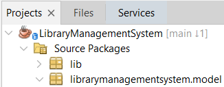
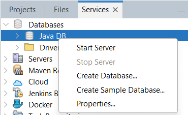

# PRG381 Project: Milestone 2
## Apache NetBeans 
> [!NOTE]
> This project can only run on Apache NetBeans 21.
### Downloading and Installing Apache NetBeans
1. Download NetBeans 21 [here](https://netbeans.apache.org/front/main/download/nb21/). (`Installers and Packages` -> `Apache-NetBeans-21-bin-windows-x64.exe (SHA-512, PGP ASC)`)
2. Open the "Apache-NetBeans-22-bin-windows-x64.exe" file in Downloads
3. Go through the NetBeans IDEA Setup. (`Next` -> `Accept terms` -> `Installation folder`)
4. Install.
5. Open the cloned GitHub repository with Apache NetBeans IDEA.

## Apache Derby Installation & Configuration
### Installation:
1. Download Apache Derby:
   - Visit the following website [Apache Derby Downloads](https://db.apache.org/derby/derby_downloads.html).
2. Download the zipped folder:
   - Navigate to the **For Java 21 and Higher** section
   - Download the zipped folder directly from this link: [Apache Derby 10.17.1.0](https://dlcdn.apache.org//db/derby/db-derby-10.17.1.0/db-derby-10.17.1.0-bin.zip)

> [!NOTE]
> Store the folder in a location where it can be easily found and accessed later.

### Configuration:
1. **Access the Services Tab**: 
   - In your project folder, `Services` tab in the file explorer.
  
   
   
3. Navigate the JavaDB Properties:
   - Under `Services`, expand `Databases` and locate `JavaDB`.
  
   

> [!NOTE]
> All other options except `Properties` should be greyed out unless the server is already configured, as shown in the example.

4. Configure the Properties as follows:
   - **Java DB Installation:** Browse and select the unzipped Apache Derby folder.
   - **Database Location:** Navigate to your project directory, create an empty folder (e.g., `database`), and include this folder in the directory path.
5. Click `Ok` to save the settings and navigate back to `JavaDB`
6. Right click on `JavaDB` and click `Start Server`.
